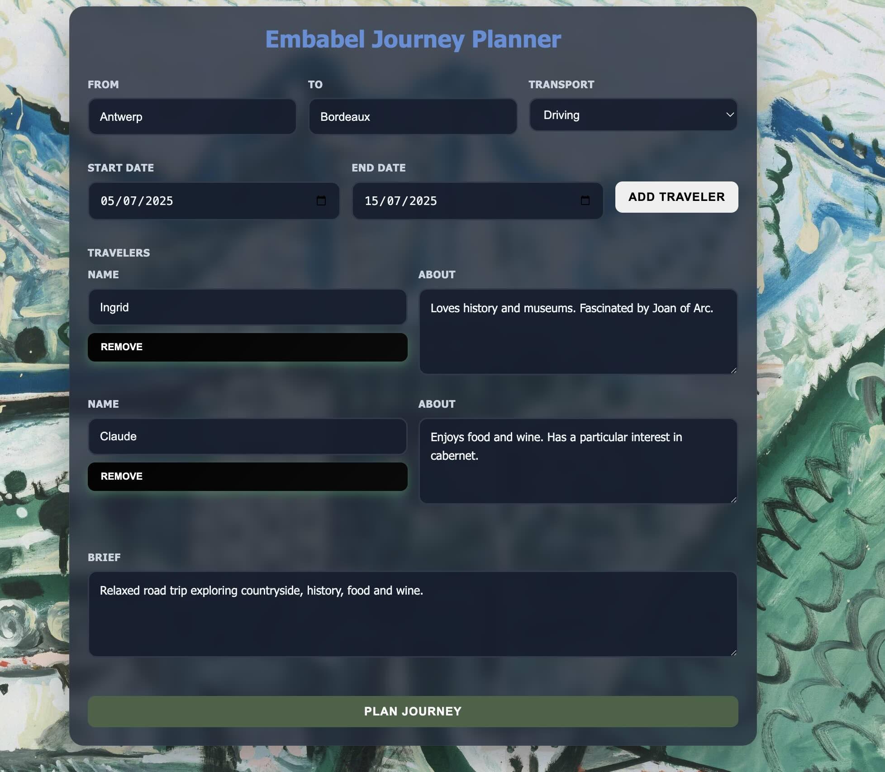
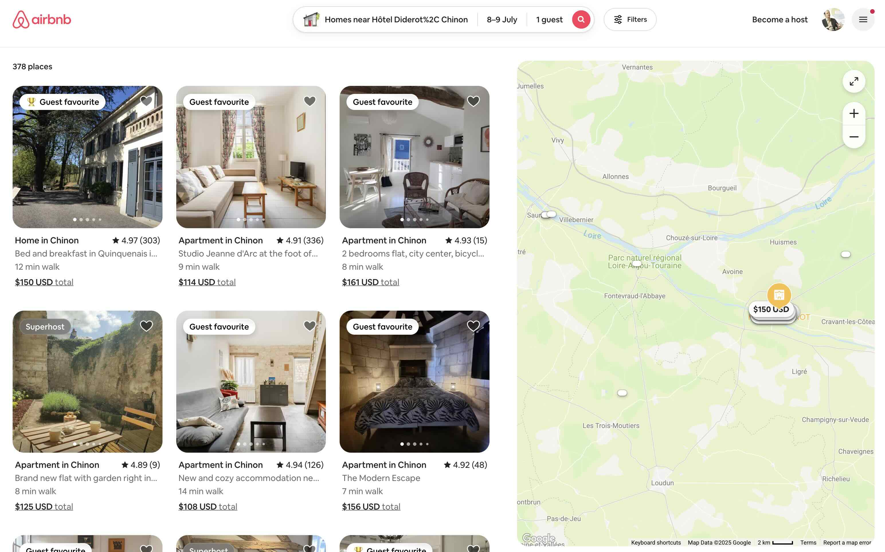
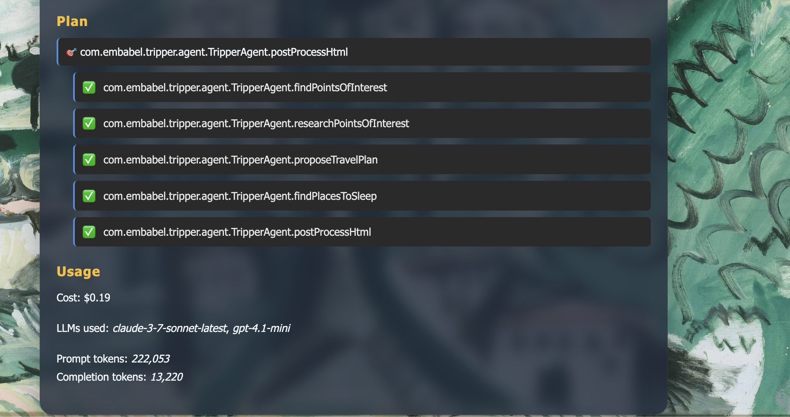
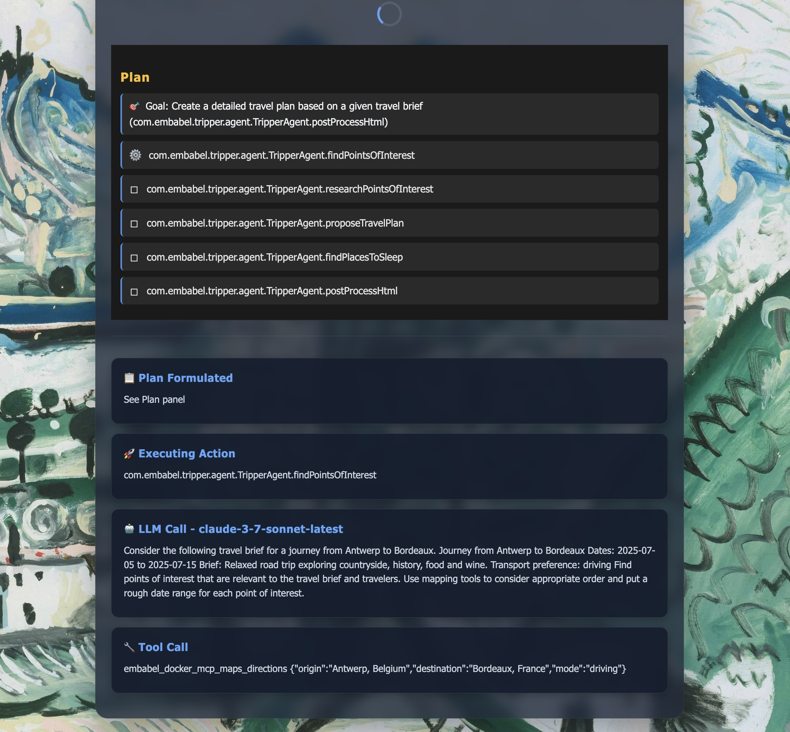

# Tripper: Embabel Travel Planner Agent


<div >


</div>

---

<table>
<tr>
<td width="200">

</td>
<td>

**Tripper** is a travel planning agent that helps you create personalized travel itineraries,
based on your preferences and interests. It uses web search, mapping and integrates with Airbnb.
It demonstrates the power of the [Embabel agent framework](https://www.github.com/embabel/embabel-agent).

**Key Features:**

- 🤖 Demonstrates Embabel's core concepts of deterministic planning and centering agents around a domain model
- 🌍 Illustrates the use of multiple LLMs (Claude Sonnet, GPT-4.1-mini) in the same application
- 🗺️ Extensive use of MCP tools for mapping, image and web search, wikipedia and Airbnb integration
- 📱 Modern web interface with htmx
- 🐳 Docker containerization for MCP tools
- 🚀 CI/CD with GitHub Actions

</td>
</tr>
</table>

## 🚀 Quick Start

> Warning: Tripper is a genuinely useful travel planner. But be aware that its extensive LLM usage will cost money. A
> typical run costs around $0.15c.

### Prerequisites

- Java 21+
- Docker
- Maven 3.6+

### Environment Setup

1. **Configure API Keys**
   ```bash
   export OPEN_AI_API_KEY=your_openai_api_key_here
   export ANTHROPIC_API_KEY=your_anthropic_api_key_here
   # Set your Brave API key for image search
   export BRAVE_API_KEY=your_brave_api_key_here
 
   ```

2. **Set MCP Environment variables** for MCP tools running in Docker
   ```bash
   # Copy the example environment file
   cp mcp.env.example .mcp.env
   
   # Edit mcp.env with your configuration
   nano .mcp.env
   ```

### Running the Application

1. **Start Background Services**
   ```bash
   docker compose --file compose.yaml --file compose.dmr.yaml up
   ```

2. **Launch the Travel Planner**

   **Option A: Using Shell Script**
   ```bash
   ./run.sh
   ```

   **Option B: Using IDE**
    - Open the project in your IDE
    - Run it in the way your IDE runs Spring Boot apps. In IntelliJ IDEA, simply run the main method in
      `TripperApplication.kt`.

3. **Access the Application**
    - Travel Planner: [http://localhost:8080/](http://localhost:8080/)
    - Platform Info: [http://localhost:8080/platform](http://localhost:8080/platform)

### Setup OAuth Credentials

Enable security by changing the following line in `application.properties`:

```properties
embabel.security.enabled=true
```

Then follow these steps to set up Google OAuth:

1. Get Google OAuth credentials from [Google Cloud Console](https://console.cloud.google.com/)
2. Add redirect URI: `http://localhost:8080/login/oauth2/code/google`
3. Set your `GOOGLE_CLIENT_ID` and `GOOGLE_CLIENT_SECRET` environment variables:
   ```bash
   export GOOGLE_CLIENT_ID=your_google_client_id_here
   export GOOGLE_CLIENT_SECRET=your_google_client_secret_here
   ```

For more details, see the [Security Guide](README-SECURITY.md).

## 📸 Screenshots

<div align="center">

### Itinerary Input



*Input form for travel preferences*

### Generated Itinerary


*AI-generated travel itinerary with detailed recommendations*

### Link to Interactive Map


*Map link included in output*

### Link to Airbnb



*Airbnb links for each stay of the trip*

### Plan and Usage Information



*Information about plan and usage, including total cost*

### Event Stream



*Emits events about process flow*

</div>

## 🏗️ Architecture

The Tripper agent follows a modern microservices architecture:

```
┌─────────────────┐    ┌─────────────────┐    ┌─────────────────┐
│   Frontend      │    │   Spring Boot/  │    │      LLMs       │
│   (htmx)        │◄──►│ Embabel Backend │◄──►│ (Claude,GPT 4)  │
└─────────────────┘    └─────────────────┘    └─────────────────┘
                                │
                                ▼
                       ┌─────────────────┐
                       │   Docker        │
                       │   MCP tools     │
                       └─────────────────┘
```

**Components:**

- **Frontend**: Modern web interface built with htmx for seamless interactions
- **Backend**: Kotlin-based Spring Boot application handling business logic. Key flow is defined in `TripperAgent.kt`.
- **LLMs**: Illustrates use of multiple LLMs
- **Containerization**: Docker for consistent deployment across environments and MCP tool management

## 🛠️ Development

### Tech Stack

- **Backend**: Kotlin, Embabel, Spring Boot, Apache Tomcat
- **Frontend**: htmx, JSON APIs
- **Build**: Apache Maven
- **DevOps**: Docker, GitHub Actions

### Contributing

1. Fork the repository
2. Create a feature branch (`git checkout -b feature/amazing-feature`)
3. Commit your changes (`git commit -m 'Add some amazing feature'`)
4. Push to the branch (`git push origin feature/amazing-feature`)
5. Open a Pull Request

## 📝 License

This project is licensed under the Apache License - see the [LICENSE](LICENSE) file for details.

## 🤝 Support

For questions, issues, or contributions, please visit our [GitHub repository](https://github.com/embabel/embabel-agent)
or open an issue.

## Contributors

[](https://github.com/embabel/tripper/graphs/contributors)


---

<div align="center">

(c) Embabel 2025

[🌐 Website](https://embabel.com) • [📧 Contact](mailto:info@embabel.com) • [🐦 Twitter](https://twitter.com/springrod)
